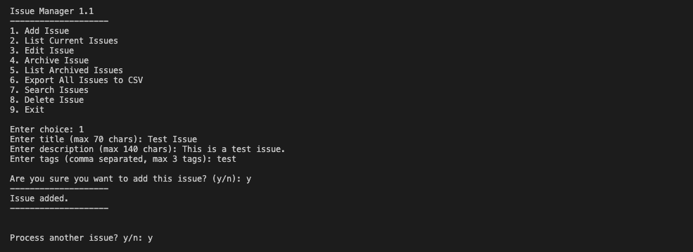

# Issue Manager 1.0



Issue Manager is a simple command-line application for managing issues. It allows you to add, list, edit, archive, delete, and search for issues. The application uses SQLite for data storage and supports exporting issues to CSV files.

## Features

### 1.0

- **Add Issue**: Add a new issue with a title, description, and tags.
- **List Current Issues**: List all current (non-archived) issues.
- **Edit Issue**: Edit the details of an existing issue.
- **Archive Issue**: Archive a resolved issue.
- **List Archived Issues**: List all archived issues.
- **Export All Issues to CSV**: Export all issues to a CSV file.
- **Search Issues**: Search for issues based on a search term.
- **Delete Issue**: Delete an open issue.

### 1.1

- **Confirmation Prompts**: Added confirmation prompts for adding, editing, archiving, and deleting issues.
- **Limit on Number of Issues**: Limited the number of current issues to 7 to motivate users to resolve issues.
- **Enhanced Input Editing**: Enabled arrow keys and delete buttons while entering information using the `readline` module.
- **Fixed Edit Issue Bug**: Fixed a bug where editing an issue created a new issue instead of updating the existing one.
- **Database Integration**: Replaced JSON data storage with SQLite database for better performance and scalability.

## Main Feature

### SQite Enhancements

1. Error Handling: Implement try-except blocks to handle potential database errors (e.g., connection issues, invalid SQL queries).
2. Data Types: Use appropriate SQLite3 data types (`TEXT`, `INTEGER`, `REAL`, `BLOB`, etc.) for the columns.
3. Security: Use parameterized queries to prevent SQL injection vulnerabilities.
4. Performance: Optimize the queries and use indexes for faster data retrieval.
5. Database Interaction: Include methods for interacting with the database, such as creating, reading, updating, and deleting records.
6. Validation: Include validation logic to ensure that the data being stored meets certain criteria.
7. Abstraction: Provide an abstraction layer between the database and the application logic, making it easier to manage and manipulate data.
8. Documentation: Include comments and documentation to explain the purpose of each method and how to use them.

## Installation

### macOS

```sh
# Clone the repository
git clone https://github.com/unqdlphn/issue_manager.git
cd issue_manager/src

# Set up Python environment
python3 -m venv .venv
source .venv/bin/activate

# Install dependencies
pip install -r requirements.txt
```

### Windows

```sh
# Clone the repository
git clone https://github.com/unqdlphn/issue_manager.git
cd issue_manager\src

# Set up Python environment
python -m venv .venv
.venv\Scripts\activate

# Install dependencies
pip install -r requirements.txt
pip install pyreadline  # Windows-specific readline implementation
```

### Linux

```sh
# Clone the repository
git clone https://github.com/unqdlphn/issue_manager.git
cd issue_manager/src

# Set up Python environment
python3 -m venv .venv
source .venv/bin/activate

# Install dependencies
pip install -r requirements.txt
```

## Usage

Run the application:
```sh
python issue_manager.py  # Use python3 on some systems
```

### Menu Options

1. **Add Issue**: Create a new issue
2. **List Current Issues**: View all non-archived issues
3. **Edit Issue**: Modify an existing issue
4. **Archive Issue**: Move resolved issues to archive
5. **List Archived Issues**: View archived issues
6. **Export All Issues to CSV**: Save all issues to a file
7. **Search Issues**: Find issues by keyword
8. **Delete Issue**: Remove an open issue
9. **Exit**: Close the application

## User Guide

### Adding an Issue
1. Select option `1` from the main menu
2. Enter a title (maximum 100 characters)
3. Enter a description (maximum 500 characters)
4. Enter tags (comma-separated, maximum 5 tags)
5. Confirm by typing `y`

### Listing Current Issues
1. Select option `2` from the main menu
2. View the tabulated list of all non-archived issues
3. Issues are displayed with ID, title, description, status, tags, and date

### Editing an Issue
1. Select option `3` from the main menu
2. Enter the ID of the issue you want to edit
3. For each field, press Enter to keep the current value or type a new value
4. For status, choose one of the following options:
   - Type `o` for Open
   - Type `i` for In Progress
   - Type `r` for Resolved
   - Type `a` for Archived
   - (You can also type the full status name)
5. If status is set to Resolved, enter a resolution
6. Confirm changes by typing `y`

### Archiving an Issue
1. Select option `4` from the main menu
2. Enter the ID of the resolved issue you want to archive
3. Confirm by typing `y`
4. Note: Only issues with status "Resolved" can be archived

### Viewing Archived Issues
1. Select option `5` from the main menu
2. View the tabulated list of all archived issues

### Exporting to CSV
1. Select option `6` from the main menu
2. All issues will be exported to a CSV file named `all_issues.csv`

### Searching for Issues
1. Select option `7` from the main menu
2. Enter a search term
3. View all issues that match the search term in title, description, status, or tags

### Deleting an Issue
1. Select option `8` from the main menu
2. View the list of open issues (only open issues can be deleted)
3. Enter the ID of the issue you want to delete
4. Confirm by typing `y`

## Testing

The project includes a comprehensive test suite with 88% code coverage, ensuring reliability and stability.

### Running Tests

To run the test suite:

```bash
pytest
```

To run tests with coverage reporting:

```bash
# Run tests and generate coverage data
pytest --cov=src --cov-report=html > tests/test_errors.txt

# View the HTML coverage report
open htmlcov/index.html
```

### Test Organization

Tests are organized into several modules:

- `test_database.py` - Tests for database connection and operations
- `test_models.py` - Tests for the Issue model class
- `test_issue_manager.py` - Tests for core application functionality
- `test_direct_coverage.py` - Tests for ensuring direct code coverage
- `test_interactive_functions.py` - Tests for user input handling
- `test_edge_cases.py` - Tests for edge cases and error handling

### Coverage Report

Current coverage metrics:

| Component        | Coverage |
|------------------|----------|
| database.py      | 94%      |
| issue_manager.py | 85%      |
| models.py        | 86%      |
|------------------------------
| **TOTAL**        | **88%**  |

## Screenshots


*Screenshot: Adding a new issue through the command line interface*


*Screenshot: Viewing the list of current issues*


*Screenshot: Searching for issues by keyword*

## Example

Issue Manager 1.0
--------------------
1. Add Issue
2. List Current Issues
3. Edit Issue
4. Archive Issue
5. List Archived Issues
6. Export All Issues to CSV
7. Search Issues
8. Delete Issue
9. Exit

Enter choice: 1
Enter title: Example Issue
Enter description: This is an example issue.
Enter tags (comma separated): example, test
Are you sure you want to add this issue? (y/n): y
--------------------
Issue added.
--------------------

## License

© 2025 Torrey L. Adams
All rights reserved.

This project is licensed under the MIT License.